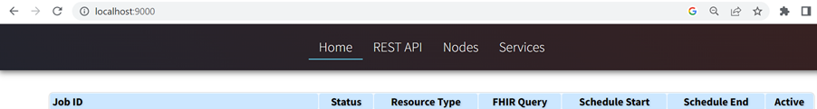

# FHIR Datafix Framework

# Installation Guide

**Contents**

[1 Overview](#overview)

[1.1 Intended Audience](#intendend-audience)

[1.2 Technical Overview](#technical-overview)

[2 Server Preparation](#server-preparation)

[3 Installation](#installation)

[3.1 Configuration Files](#configuration-files)

# Overview

This document provides guidance on how to install and configure FHIR Datafix framework for correcting FHIR resource within FHIR Appliance.

## Intended Audience

The main audience is technical staff at a Data Provider who will be involved in the installation and configuration of a FHIR Datafix Framework.

## Technical Overview

Following diagram provides very high-level conceptual overview of the FHIR Datafix Framework deployment architecture.

FHIR Datafix Framework is written in Node.js and it is wrapped as a Docker container for ease of deployment.

FHIR Datafix Framework can be deployed/installed alongside with FHIR Appliance or can be installed on separate server. It needs docker as deployment technology, The core FHIR Datafix Framework component is provided as a Docker container, this makes it highly portable for deployment purposes.

It can be installed on following supported operating systems.

- **Linux**  – the central messaging exchange systems run on Linux, and this is the original, native, environment of the FHIR Datafix Framework.

If deployment to Linux (Ubuntu 18.04) is an option, then it is recommended as the preferred choice.

- **Windows Server 2019**  – the core FHIR Datafix Framework can be deployed as a container on Windows Server. Specialist "windows" docker containers are required for Windows Server, and appropriate deployments of the core FHIR Datafix Framework are provided for Windows Server 2019.
- **Docker Desktop (Windows 10, Mac, Linux)** – this is another option for non-production deployments. Docker Desktop runs Linux Containers.

_Note on Windows 10 – On Windows 10 then Microsoft now provide the Windows Subsystem on Linux v2 (WSL2). This offers full Linux support, and therefore Windows 10 can now run native Linux containers. Evidently this is a desktop operating system however, and not suitable for production deployments_

# Server Preparation

If installing alongside with FHIR Appliance (Node.js version), this step can be ignored as server is already prepared to run Node.js application. Alternatively, please follow below instruction to setup and prepare server for Node.js application.

[https://github.com/yorkshire-and-humber-care-record/fhir-appliance/blob/master/docs/install-guide/FHIR-Appliance-Install-02-Server-Preparation.md](https://github.com/yorkshire-and-humber-care-record/fhir-appliance/blob/master/docs/install-guide/FHIR-Appliance-Install-02-Server-Preparation.md)

# Installation

Download repository and navigate to install directory and configure docker-compose.yml and .env files as described below.

## Configuration Files

**Docker Compose Configuration:**

docker-compose.yml – this is the main Docker Compose configuration file which describes the whole environment. Please take some time to study this file, and make sure you understand each section and what it does.

_A couple of points that may need further explanation:_

_You will see some "volumes" entries – these are mostly obvious and mount configuration files so that they are visible inside the docker environment. This will be used to add plugins or data fix scripts which will used by Datafix Framework._

**FHIR Datafix Framework Configuration**

The .env file is the configuration file for the FHIR Datafix Framework. The file is well documented with comments, so again please take some time to study this file and understand the various sections

**Start Framework**

It is assumed that you have already worked through "Server Preparation" steps to install prerequisites on the server and done required configurations.

- Make sure you have Docker installed (Server Preparation step)
- Configuration files downloaded and inspected
- Navigate to directory where docker-compose file and configuration is downloaded and configured
- Run docker-compose up -d
- Browse to [http://localhost:9000/](http://localhost:9000/) to view the FHIR Datafix App running
- If successful you should see following screen

**Please follow FHIR Datafix Framework User Guide for configuration of Jobs and schedules.**

