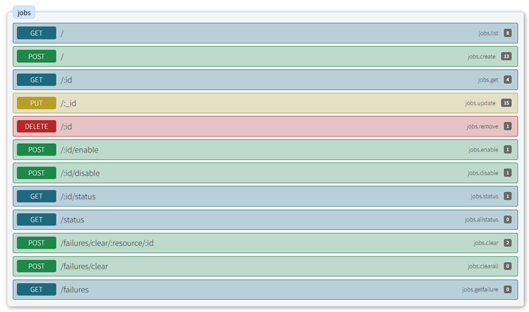
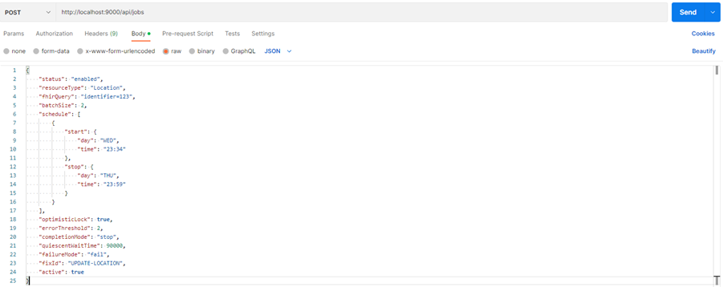
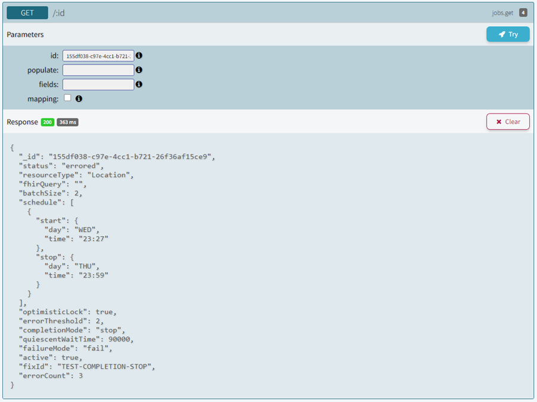
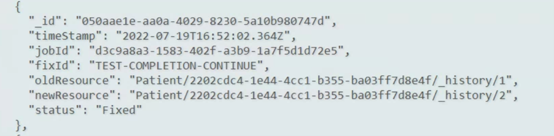

# FHIR Datafix Framework

# User Guide

**Contents**

[1 Overview](#overview)

[1.1 Intended Audience](#intended-audience)

[2 Job configuration](#job-configuration)

[3 Jobs API](#jobs-api)

[4 Processing](#processing)

[5 Plug-ins and Context Services](#plug-ins-and-context-services)

[6 Auditing](#auditing)


# Overview

This document provides guidance on how to configure and use the FHIR Datafix framework for configuring different jobs with schedule for correcting and/or deleting FHIR resources within the FHIR Appliance.

## Intended Audience

The main audience is technical staff at a Data Provider who will be involved in the installation and configuration of a FHIR Datafix Framework.

# Job configuration

First make sure FHIR Datafix Framework up and running, you should see following screen.


The definition of what work to perform is contained in a "job", FHIR Datafix can be configured with multiple jobs.

A simple job definition contains:

- **status** : Job Status - allowed values are enabled/disabled/errored/complete
- **resourceType** : FHIR Resource Type, e.g., Patient, Encounter ...
- **fhirQuery** : FHIR Query, e.g., identifier=XYZ. This is optional, if not provided then all resource for configured resource type will be searched.
- **batchSize** : Identifies how many resources to query for in a batch
- **schedule** : Schedule to run Job. e.g. [{"start":{"day":"MON","time":"00:00"},"stop":{"day": "MON","time": "02:59"}}]
- **optimisticLock** : Enable optimistic locking (will check that the resource hasn't been updated in between retrieval and update).
- **errorThreshold** : Error threshold – number of errored updates that will automatically stop the job and mark it as errored.
- **completionMode** : Completion mode – when the FIHR query returns no matching result, should the job stop or just wait for a time?
- **quiescentWaitTime** : Quiescent wait time – time between checks for FHIR resources if there are zero resources to fix
- **failureMode** : Failure mode – either "retry" to allow the resource to be retried on subsequent queries or "fail" where it will not be re-fetched
- **Active** – active or inactive job status
- **fixId** - Meaningful, string rather than a guid. it will be some text provided by the user. eg "IW-PROFILE-ALIGN-20220718"

- **plugin** - Optional plugin file name. Use if there is a need to run multiple data fix jobs for the same resource type on different schedules. If not provided plugin scripts will be identified by resource type. For example, if resource type is Patient, then plugin will be Patient.js unless this field is set.
- **interaction** - mandatory field to denote the intended action for the job to perform, it is limited to values of ‘delete’ and 'update'.

Following is the example of simple job object

```
{
    "status": "enabled",
    "resourceType": "Location",
    "fhirQuery": "identifier=123",
    "batchSize": 2,
    "schedule": [
        {
            "start": {
                "day": "WED",
                "time": "23:34"
            },
            "stop": {
                "day": "THU",
                "time": "23:59"
            }
        }
    ],
    "optimisticLock":  **true** ,
    "errorThreshold": 2,
    "completionMode": "stop",
    "quiescentWaitTime": 90000,
    "failureMode": "fail",
    "fixId": "UPDATE-LOCATION",
    "active":  **true**,
    "interaction": "update"
}
```

# Jobs API

Following Jobs API can be used to create, update, or delete jobs. There are some additional APIs available to get more detailed information about jobs

| Interaction | Path | Function |
| --- | --- | --- |
| Search | GET /jobs | Find all jobs and return their configuration |
| Read | GET /jobs/:id | Retrieve specific job configuration |
| Create | POST /jobs | Create a job – job is return in Location header |
| Update | PUT /jobs/:id | Updates a job |
| Delete | DELETE /jobs/:id | Deletes a job |
| Enable | POST /jobs/:id/enable | Sets the active flag to true and starts the job if not running |
| Disable | POST/jobs/:id/disable | Sets the active flag to false and stops the job if running |
| Status | GET /jobs/:id/status | Get details on the job including:
- Running / Stopped
- Enabled / Disabled / Errored / Complete
- Current Throttle
- Current Rate of updates
- Total resources fetched and updated
- Error count
- Estimate of total candidate resources left in the FHIR store
 |
| Overall Status | GET /status | Report on all running jobs |
| Clear Failure | POST /failures/clear/:resource/:id | Updates the given resource/id and removes the failure tag |
| Clear All Failures | POST /failures/clear | Finds all failed resources and removes the failure tag. |
| Get Failures | GET /failures | Returns all resources that have failed |



This APIs can be used with Postman or directly from FHIR Datafix Framework as shown below.

**Create Job using Postman:**



Get job using FHIR Datafix Framework UI



# Processing

When a job runs, it checks its schedule to see if it should be running at this time and if so, load the plug-in code for the job's resource type. It then enters the main loop which:

- Issues the configured FHIR query to the target appliance endpoint with appropriate batch size.
- It will also update FHIR query to exclude all resource which has been already processed by Datafix Framework - check for tag 
```
    "https://interweavedigital.com/fhirfix/Fix/<fixId>"
```
- For each returned resource, pass to the plugin of that resource
- If the plugin returns a resource and indicates it should replace the original, then it will send update to the FHIR appliance.

## Success

If the update is successful, entry to the audit log specifying the old and new versions of the resource using a versioned FHIR reference will be added, e.g.



## Failure

If the update fails logs will be updated. The job has a "failure mode" setting which, if set to "retry" will do nothing; since the resource will not be updated, it will be re-found and re-tried in subsequent cycles.

If the mode is "fail", then the resource will be updated with the tag 
```
 {"system": "https://interweavedigital.com/fhirfix/Fix/<fixId>", "code": failed", "display": "\<error messsage\>"}
```
If the number of errors exceeds the error threshold, Job status changed to errored and will stop the job

Failed resources that have been marked as failed can be retrieved using the Get Failures API call.

## Completion

When the FHIR query returns no results for the job, then if the completion mode is set to "stop", then job will be stopped and marked status as complete.

If the mode is "continue", the loop that queries for resources will sleep for the quiescent wait time before searching for more resources.

# Plug-ins and Context Services

If `plugin` file name is provided, then it will be used, otherwise plugin scripts will be identified by `resource type`. For example, if `resource type` is `Patient`, then plugin will be `Patient.js` unless plugin field is set. It should be noted that if the `plugin` field is provided, the plugin file must exist to avoid the job yielding an error.

The job specification includes a resource type, so in the plugin folder, FHIR Fix will expect to find the code for that resource. When called, FHIR Fix will pass an instance of that resource along with a context object that provides information about the job and a way for the plugin code to call some contextual services detailed below.

## Mandatory Plugin Functions
For a job where `interaction: "update"` the plugin must be present and conform to an interface method/function of:

### fixResource
```
fixResource(resource::object, context::object) :: object
```

 - The resource parameter will be the FHIR resource to fix and the context will have information on the job as well as providing callback methods below.
 - The function must return the updated resource or throw an error/exception with a diagnostic message.

Example:

```
module.exports = {
    name:"patient.plugin.mixin",
    methods: {
    asyncfixResource(fhirResource, ctx) {
// Update fhir resource
returnfhirResource;
}
```

For a job where `interaction: "delete"` the plugin is entirely optional. It is possible to schedule a job to delete resources purely by the job `fhirQuery` field.

## Optional Plugin Functions

Plugins can optionally define the following functions:

### filterResource
```
filterResource(resources: FhirResourceObject[]): FhirResourceObject[]
```

 - This optional operation occurs immediately after the fhirQuery is executed and can be used to reduce the resource set that the update operation is applied to. It should be used when complex logic is required to filter resources where a single fhirQuery might struggle.
Example:


```
	module.exports = {
	  name: "patient.plugin.mixin",
	  methods: {
	    filterResources(resources) {
	      const filteredResources = [];
	      // apply filtering logic ...
	      return filteredResources;
	    }
	  }
}
```

### fhirHeaders
```
fhirHeaders(resource: FhirResourceObject): { [key: string]: string }
```

 - If present this function will be called before sending update or delete requests to the FHIR Store. It is called per resource and can be used to populate additional headers to send with the request. i.e. an expiry header on a delete request. It should return a standard object with string keys and values.
Example:

```
	module.exports = {
	  name: "patient.plugin.mixin",
	  methods: {
	    fhirHeaders(resources) {
	      const headers = {};
	      // logic to apply desired headers to object
	      return headers;
	    }
	  }

```

## Other Functions

### getFHIR
```
getFHIR(resourceType, id, query)
```

The plugin code may need access to other FHIR resources in the target appliance to decide on how to code its resource. The context will provide a getFHIR method that will cause FHIR Fix to issue the desired FHIR query to the target appliance and deliver the results to the plug-in

# Auditing

All successful or failed attempt by Job will be audited. Audit data can be accessed by audit API.

| Interaction | Path | Function |
| --- | --- | --- |
| Search | GET /audit | Find all audit events |
| Read | GET /audit/:id | Retrieve specific audit event |

